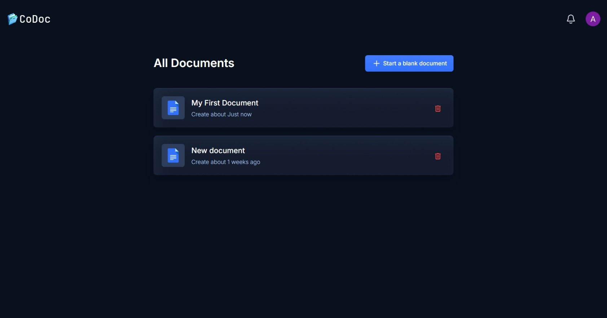
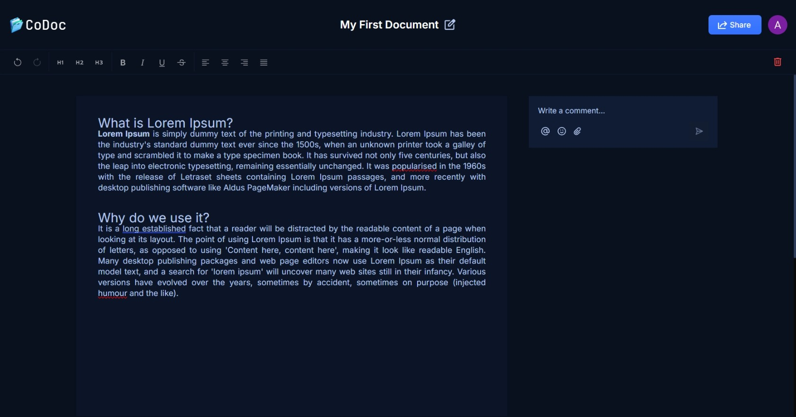
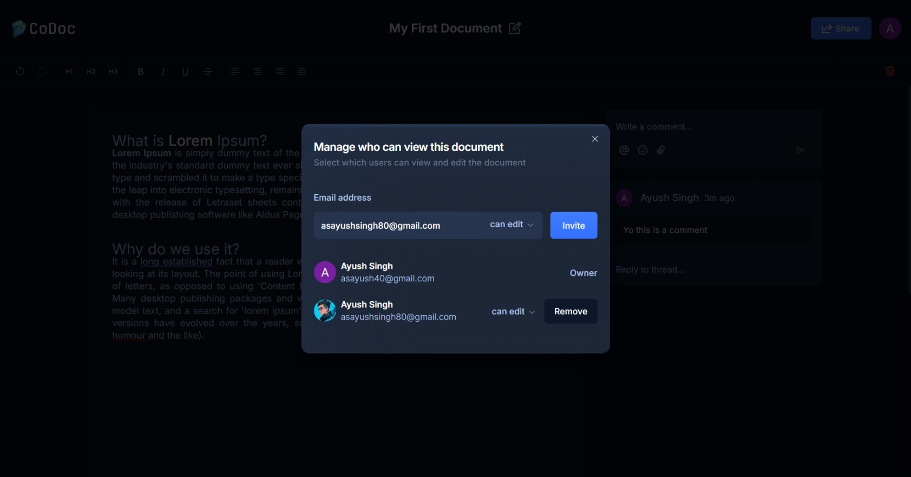
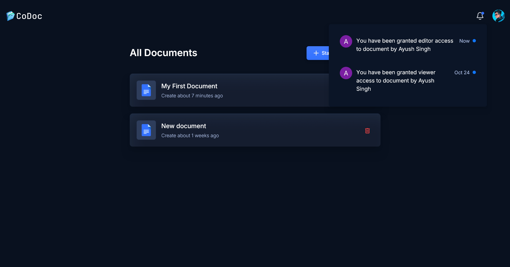
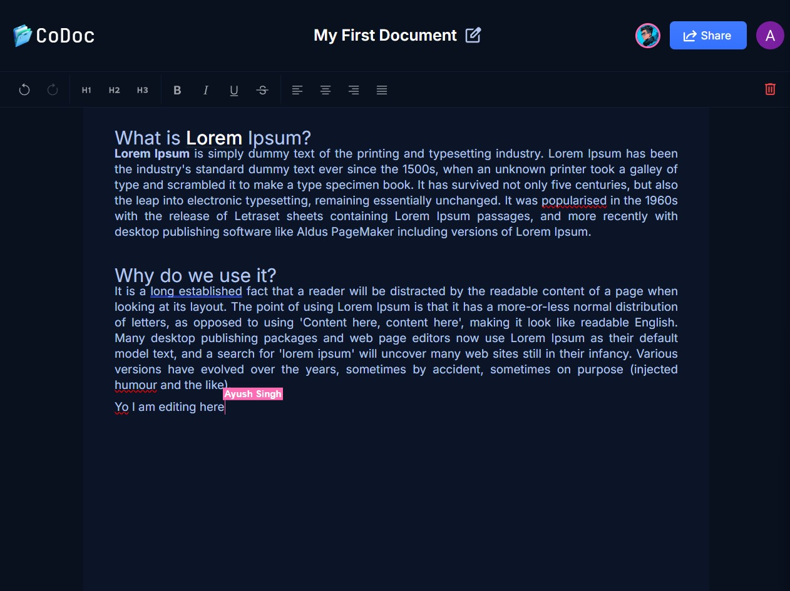
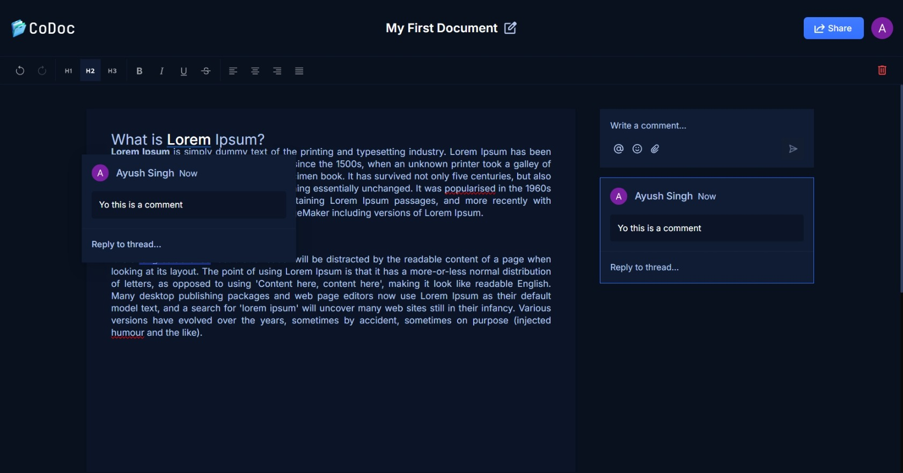
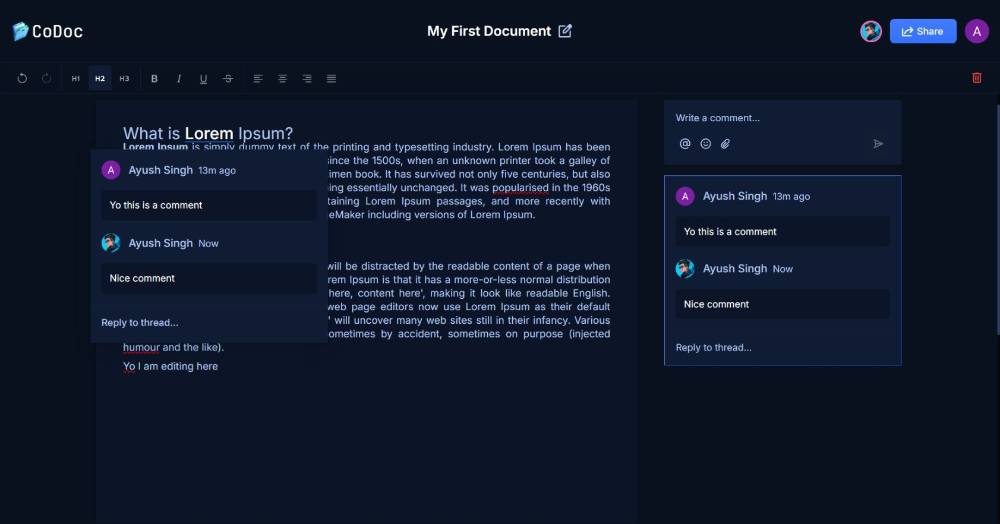

## CoDoc: Collaborative Markdown Editor

Codoc is a web-based markdown editor designed for seamless collaboration. Bring your team together in real-time to create, edit, and share documents with ease.

**Try it out** - https://codoc-beta.vercel.app 

## Key Features

- Real-time Collaboration: Invite team members to edit documents simultaneously.
- Markdown Support: Write in markdown and preview in real-time.
- Live Preview: Instantly see your formatted text.
- Multi-Device Support: Access and edit from anywhere.

## Screenshots

### Dashboard

### Editor

### Document permissions

### Notifications

### Live Collaboration

### Comments

## How to run?

1. Clone the repository: `git clone https://github.com/Ayush-Singh24/CoDoc.git`
2. Navigate to the project directory: `cd codoc`
3. Install dependencies: `npm install` or `yarn install`
4. Start the server: `npm start` or `yarn start`

